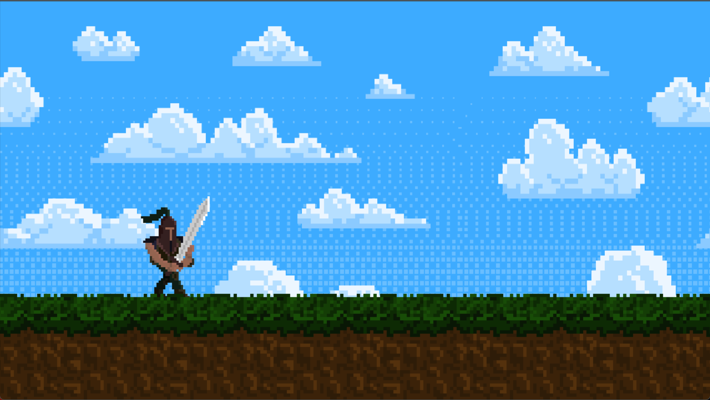

# SDL2 Platformer Game

A simple 2D platformer game built using C++, SDL2, SDL2_image, and SDL2_ttf. Jump, dodge fireballs, and enjoy smooth animations in a retro-inspired environment.

## Features

- Player movement and jumping
- Animated backgrounds and ground tiles
- Fireball obstacles with collision detection
- Game over and restart functionality
- Popup text and custom fonts
- Continuous fireball spawning for challenging gameplay

## Screenshots



## Getting Started

### Prerequisites
- Windows OS
- [MSYS2](https://www.msys2.org/) with MinGW-w64
- SDL2, SDL2_image, SDL2_ttf libraries installed

### Build Instructions

1. Open MSYS2 MinGW64 terminal.
2. Install dependencies (if not already):
   ```sh
   pacman -S mingw-w64-x86_64-gcc mingw-w64-x86_64-SDL2 mingw-w64-x86_64-SDL2_image mingw-w64-x86_64-SDL2_ttf
   ```
3. Build the project:
   ```sh
   g++ -IC:/msys64/mingw64/include/SDL2 -Iinclude src/main.cpp src/renderWindow.cpp src/entity.cpp -LC:/msys64/mingw64/lib -lmingw32 -lSDL2main -lSDL2 -lSDL2_image -lSDL2_ttf -o build.exe
   ```
4. Run the game:
   ```sh
   ./build.exe
   ```

## Controls

- **Space**: Jump
- **P**: Toggle popup text
- **R**: Restart after game over
- **Close Window**: Quit game

## Folder Structure

```
include/         # Header files
res/             # Game assets (fonts, graphics)
src/             # Source code
build.exe        # Compiled game
```

## Credits
- SDL2 libraries
- Kenney.nl for some graphics
- [Kenpixel.ttf](res/fonts/kenpixel.ttf) font

## License
This project is for educational purposes. See asset licenses for details.
